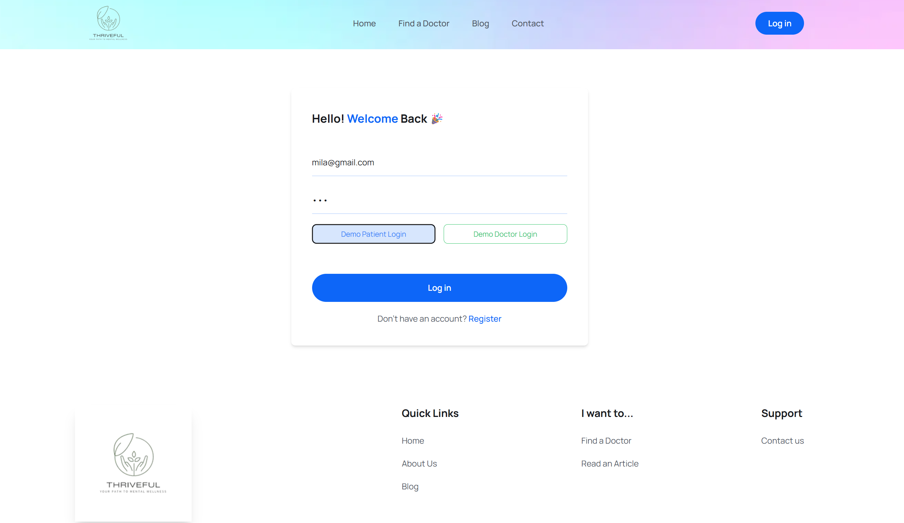
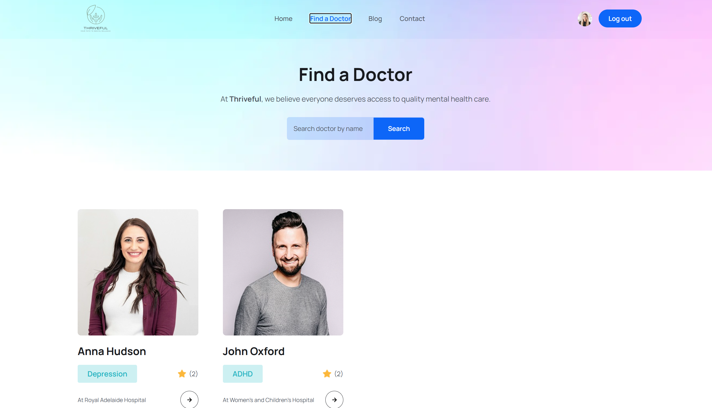
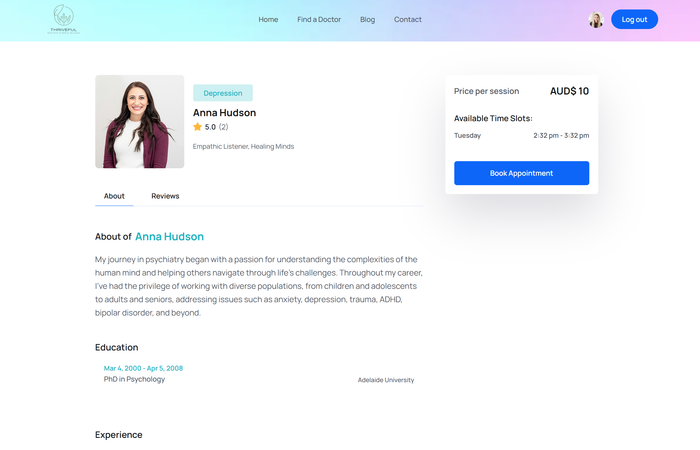
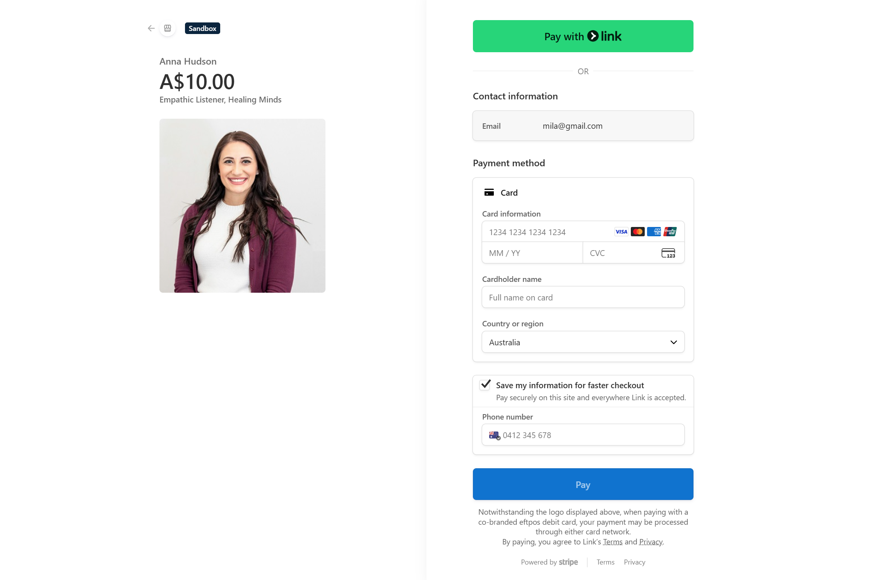
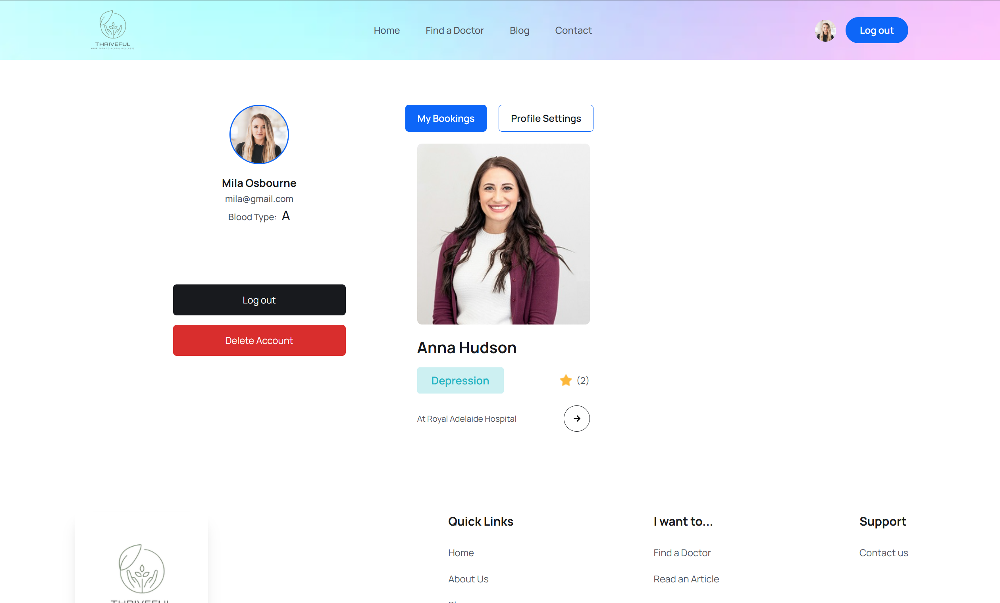
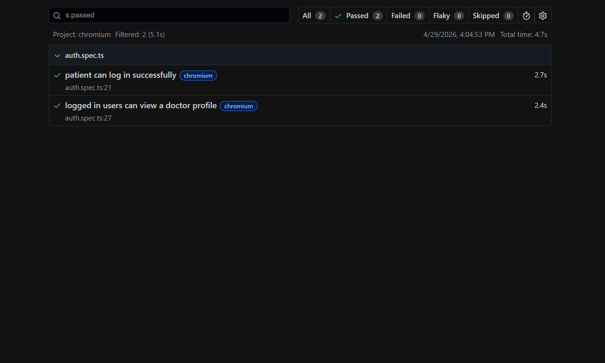
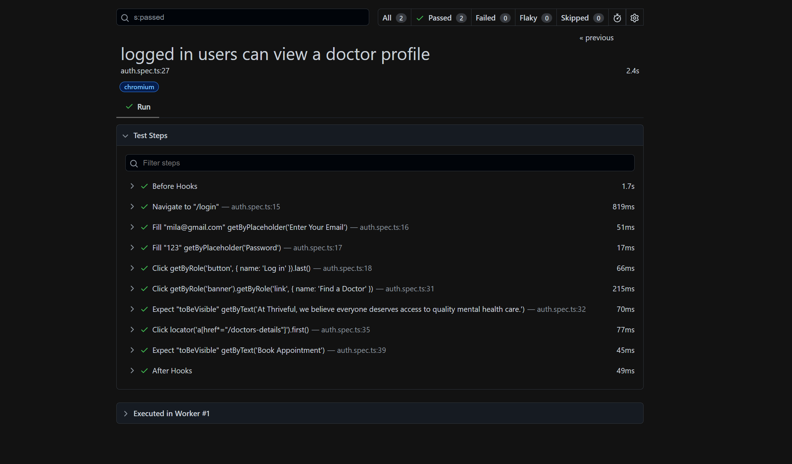

# Thriveful - Mental Health Booking Platform

A full-stack MERN application for booking online mental health sessions. Patients can find a doctor, pay via Stripe, and manage their bookings. Doctors can manage their profiles and availability.

[Live Demo](https://health-booking-website-client.vercel.app/) · [Playwright E2E Tests](#e2e-testing-with-playwright)

## Demo

Login as a patient:


Then, get redirected to the home page:


Browse available doctors:


View a doctor profile and click Book Appointment:


Complete payment via Stripe:


View the confirmed booking on the patient profile:


## Table of Contents

- [What This Does](#what-this-does)
- [Tech Stack](#tech-stack)
- [Auth and Roles](#auth-and-roles)
- [E2E Testing with Playwright](#e2e-testing-with-playwright)
- [Test Credentials](#test-credentials)
- [Getting Started](#getting-started)

## What This Does

Two user roles share a single login page but get different dashboards.
 
A patient logs in, searches for a doctor by name or specialty, views the doctor's profile, and books a session. Payment is handled through Stripe. After payment, the booking appears on the patient's profile page.
 
A doctor logs in, manages their profile, and sets their availability. New doctor accounts are set to pending until an admin approves them.
 
- Single login page for both roles, with role-based routing after login
- JWT authentication with persistent sessions
- Stripe payment integration
- Password hashing with bcryptjs
- E2E tests added using Playwright

## Tech Stack

- React, Vite
- Node.js, Express.js
- MongoDB
- Stripe
- Docker (local MongoDB)
- Playwright (E2E testing)

## Roles

Routes are protected based on three user roles: `admin`, `patient`, `doctor`.

| Rule | Who it applies to |
|------|------------------|
| Get all users / doctors data | `admin` only |
| Get / update / delete own profile | the user themselves (`patient` or `doctor`) |
| Create a review for a doctor | `patient` only |
| Submit a Contact Us feedback | anyone (no login required) |
| Appear in the doctors listing | `doctor` with `isApproved: "approved"` only |

When a doctor registers, their `isApproved` status defaults to `"pending"` until approved.

## E2E Testing with Playwright

Two end-to-end tests cover the core patient flow, run against Chromium.

Test - patient can log in successfully:


Test - logged in user can view a doctor profile:


Both tests passed in 4.7s total (2 passed, 0 failed, 0 flaky).

**What is tested**

- Patient logs in with email and password
- App redirects to the correct page after login
- Logged-in user navigates to Find a Doctor
- User opens a doctor profile page
- Doctor profile shows the Book Appointment button

**How to run**

```bash
npx playwright test
npx playwright show-report
```

## Test Credentials

**Patient**
```
email: mila@gmail.com
password: 123
```

**Doctor**
```
email: anna@gmail.com
password: 1234
```

**Stripe test card**
```
4242 4242 4242 4242
```

## Getting Started

You need three things running at the same time: MongoDB, the backend, and the frontend.

**1. Start MongoDB in Docker**

```bash
docker compose up -d
```

Run this from the project root. On subsequent runs, you can re-run the same command or press play in Docker Desktop.

To stop: `docker compose down`

**2. Set up environment variables**

```bash
cp backend/.env.example  backend/.env
cp frontend/.env.example frontend/.env
```

Fill in values from your Cloudinary and Stripe dashboards.

**3. Install dependencies**

```bash
cd backend && npm install
cd ../frontend && npm install
```

**4. Start the backend**

```bash
cd backend
npm run start-dev
```

Runs at `http://localhost:8000`

**5. Start the frontend**

```bash
cd frontend
npm run dev
```

Runs at `http://localhost:5173`